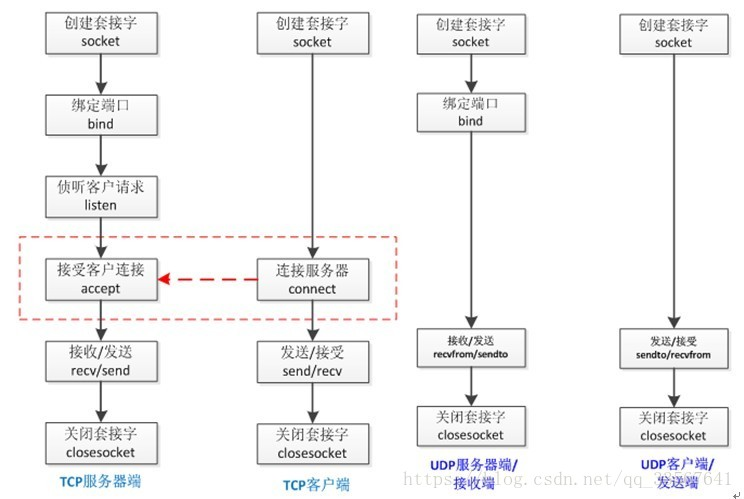

# 第三天

## 并发编程

### 线程
线程是中轻量级的进程，所有线程均在同一个进程中，共享全局内存，用于任务并行
###  常见线程用法
实例1 不同任务并行
```
import threading
import time


def helloworld():
    time.sleep(2)
    print("helloworld")


t = threading.Thread(target=helloworld)
t.start()
print("main thread")

```
注意：这里有两个线程一个是主线程，一个是通过threading模块产生的t线程，
这里程序并没有阻塞在helloword函数，主线程和t线程并行运行


实例2 同种任务并行

````buildoutcfg
import threading
import time


def helloworld(id):
    time.sleep(2)
    print("thread %d helloworld" % id)


for i in range(5):
    t = threading.Thread(target=helloworld, args=(i,))
    t.start()
print("main thread")
````

实例3 线程间同步

```python
import threading, time

def count(i):
    time.sleep(1)
    print(i)
threads = []
for i in range(1000):
    thread = threading.Thread(target=count,args=(i,))
    threads.append(thread)

for thread in threads:
    thread.start()

for thread in threads:
    thread.join()

````

加锁
```python
import threading, time

lock = threading.Lock()

def count(i):
    time.sleep(1)
    lock.acquire()
    print(i)
    lock.release()
threads = []
for i in range(1000):
    thread = threading.Thread(target=count,args=(i,))
    threads.append(thread)

for thread in threads:
    thread.start()

for thread in threads:
    thread.join()
```

使用with 加锁

```python
import threading, time

lock = threading.Lock()

def count(i):
    time.sleep(1)
    with lock:
        print(i)

threads = []
for i in range(1000):
    thread = threading.Thread(target=count,args=(i,))
    threads.append(thread)

for thread in threads:
    thread.start()

for thread in threads:
    thread.join()

```
### queue 模块

用来进行线程间通信。

```python
import threading, queue
from urllib import request

url = "https://www.baidu.com"

q = queue.Queue()

for i in range(100):
    q.put(i)


def get_baidu():
    while True:
        try:
            q.get(block=False)
            r = request.urlopen(url)
            print(r.code)
        except queue.Empty:
            break

ts = []
for i in range(100):
    t = threading.Thread(target=get_baidu())
    ts.append(t)
    t.start()

for i in ts:
    t.join()

```

###  进程

multiprocessing

```
import os

from multiprocessing import Process, Lock

def whoami(label, lock):
    msg = '%s: name:%s, pid:%s'
    with lock:
        print(msg % (label, __name__,os.getpid()))


if __name__ == '__main__':
    lock = Lock()

    for i in range(5):
        p = Process(target=whoami, args=('child', lock))
        p.start()
```


队列

```python
from multiprocessing import Process, Queue
import queue
from urllib import request

url = "https://www.baidu.com"

q = Queue()

for i in range(100):
    q.put(i)


def get_baidu():
    while True:
        try:
            q.get(block=False)
            r = request.urlopen(url)
            print(r.code)
        except queue.Empty:
            break

if __name__ == "__main__":
    ps = []
    for i in range(4):
        p = Process(target=get_baidu())
        ps.append(p)

    for p in ps:
        p.start()


    for p in ps:
        p.join()

```


进程池
```python
from multiprocessing import Pool
import time


def func(num):
    print("hello world %d" % num)
    time.sleep(1)


if __name__ == '__main__':

    pool = Pool(processes=4)

    for i in range(100):
        pool.apply_async(func, (i,))
    pool.close()
    pool.join()
```
pool.map

```
from multiprocessing import Pool
import time
def f(x):
    time.sleep(0.5)
    return x*x

if __name__ == '__main__':
    with Pool(5) as p:
        print(p.map(f, range(10)))
```

### Future

concurrent.futures供了ThreadPoolExecutor和ProcessPoolExecutor两个类，都继承自Executor，
分别被用来创建线程池和进程池，接受max_workers参数，代表创建的线程数或者进程数。ProcessPoolExecutor的max_workers参数可以为空，程序会自动创建基于电脑cpu数目的进程数。

ThreadPoolExecutor

```python
from concurrent.futures import ThreadPoolExecutor
from urllib import request

url ="https://www.baidu.com"

def get_baidu():
    r = request.urlopen(url)
    print(r.code)


with ThreadPoolExecutor(max_workers=4) as executor:
    for i in range(100):
        executor.submit(get_baidu())

```

ProcessPoolExecutor

```python
from concurrent.futures import ProcessPoolExecutor
from urllib import request

url ="https://www.baidu.com"

def get_baidu():
    r = request.urlopen(url)
    print(r.code)


if __name__ == "__main__":
    with ProcessPoolExecutor(max_workers=4) as executor:
        for i in range(100):
            executor.submit(get_baidu())

```

[推荐资料](https://python-parallel-programmning-cookbook.readthedocs.io/zh_CN/latest/)

## 网络编程

tcp和udp服务


基于TCP的socket

tcp是基于链接的，必须先启动服务端，然后再启动客户端去链接服务端

服务端
```python
import socket

HOST = '127.0.0.1'  #  监听ip地址
PORT = 8080  # 端口号
ADDRESS = (HOST, PORT)

ss = socket.socket()  # 创建一个socket
ss.bind(ADDRESS)  # 绑定
ss.listen()  # 监听

while True:
    con, add = ss.accept()  # 接受一个客户端连接
    print('Server connected by', add)
    while True:
        data = con.recv(1024)
        if not data:
            break
        con.send(b'Echo=>' + data) # 返回消息

    con.close()  # 关闭客户端连接
```

客户端
```python
import socket

HOST = '127.0.0.1'
PORT = 8080
ADDRESS = (HOST, PORT)

ss = socket.socket()  # 创建socket
ss.connect(ADDRESS)  # 建立连接
ss.send(b'This is Python')  # 发送消息
res = ss.recv(1024)  # 接受消息
print(res)
ss.close()
```
基于udp的socket

udp是无连接的，启动服务之后可以直接接受消息，不需要提前建立连接。

```python
import socket

HOST = '127.0.0.1'
PORT = 8080
ADDRESS = (HOST, PORT)

ss = socket.socket(type=socket.SOCK_DGRAM)  # udp socket
ss.bind(ADDRESS)
msg, add = ss.recvfrom(1024)
print(msg)

ss.sendto(b'Hello', add)
ss.close()


```


客户端
```python
import socket

HOST = '127.0.0.1'
PORT = 8080
ADDRESS = (HOST, PORT)

ss = socket.socket(type=socket.SOCK_DGRAM)
ss.sendto(b'This is Python', ADDRESS)
msg, add = ss.recvfrom(1024)
print(msg.decode('utf-8'), add)
ss.close()
```


udp聊天
```python
import socket
import threading


# 发送数据
def send_msg(udp_socket,dest_ip,dest_port):
    while True:
        # 接收用户输入的数据
        send_data = input("请输入您要发送的消息:")
        # 输入exit退出聊天
        if send_data == "exit":
            break
        # 发送数据
        udp_socket.sendto(send_data.encode("gbk"), (dest_ip, dest_port))


# 接收数据
def recv_msg(udp_socket):
    while True:
        # 接收数据 1024:表示每次接收数据的最大字节数
        recv_data, ip_port = udp_socket.recvfrom(1024)
        # 解码数据
        recv_content = recv_data.decode("gbk")
        print(">>>%s:%s" % (str(ip_port), recv_content))
        # print(ip_port[0] + ":" + str(ip_port[1]) + "  回复的消息:" + recv_content)


if __name__ == '__main__':
    # 创建udpsocket
    udp_socket = socket.socket(socket.AF_INET, socket.SOCK_DGRAM)

    # 绑定端口， 提示：客户端不强制要求绑定端口
    # 在同一个电脑上端口号不能重复
    udp_socket.bind(("", 8081))

    # 创建接收数据的线程
    recv_thread = threading.Thread(target=recv_msg, args=(udp_socket,))
    # 设置成为守护主线程，主线程退出后子线程直接销毁
    recv_thread.setDaemon(True)
    recv_thread.start()

    # 接收对方的ip地址和端口号
    dest_ip = input("请输入对方的ip地址:")
    dest_port = int(input("请输入对方的端口号:"))
    # 发送数据
    send_msg(udp_socket,dest_ip,dest_port)

    # 关闭socket
    udp_socket.close()
```