# 第九天
实战http接口测试平台HAT

## 功能模块
+ dashboard
+ 项目管理
+ 模块管理
+ 用例管理
+ 报告管理
+ 定时任务
+ 环境管理

## 系统架构


+ httprunner 接口测试框架
+ redis 缓存队列
+ celery 分布式任务系统

## 数据库表结构

项目表ProjectInfo
| Field            | Type         | Null | Key | Default | Extra          |
|------------------|--------------|------|-----|---------|----------------|
| id               | int(11)      | NO   | PRI | NULL    | auto_increment |
| create_time      | datetime(6)  | NO   |     | NULL    |                |
| update_time      | datetime(6)  | NO   |     | NULL    |                |
| project_name     | varchar(50)  | NO   | UNI | NULL    |                |
| responsible_name | varchar(20)  | NO   |     | NULL    |                |
| test_user        | varchar(100) | NO   |     | NULL    |                |
| dev_user         | varchar(100) | NO   |     | NULL    |                |
| publish_app      | varchar(100) | NO   |     | NULL    |                |
| simple_desc      | varchar(100) | YES  |     | NULL    |                |
| other_desc       | varchar(100) | YES  |     | NULL    |                |

模块表

| Field             | Type         | Null | Key | Default | Extra          |
|-------------------|--------------|------|-----|---------|----------------|
| id                | int(11)      | NO   | PRI | NULL    | auto_increment |
| create_time       | datetime(6)  | NO   |     | NULL    |                |
| update_time       | datetime(6)  | NO   |     | NULL    |                |
| module_name       | varchar(50)  | NO   |     | NULL    |                |
| test_user         | varchar(50)  | NO   |     | NULL    |                |
| simple_desc       | varchar(100) | YES  |     | NULL    |                |
| other_desc        | varchar(100) | YES  |     | NULL    |                |
| belong_project_id | int(11)      | NO   | MUL | NULL    |                |

用例表

| Field            | Type          | Null | Key | Default | Extra          |
|------------------|---------------|------|-----|---------|----------------|
| id               | int(11)       | NO   | PRI | NULL    | auto_increment |
| create_time      | datetime(6)   | NO   |     | NULL    |                |
| update_time      | datetime(6)   | NO   |     | NULL    |                |
| name             | varchar(50)   | NO   |     | NULL    |                |
| belong_project   | varchar(50)   | NO   |     | NULL    |                |
| author           | varchar(20)   | NO   |     | NULL    |                |
| request          | longtext      | NO   |     | NULL    |                |
| belong_module_id | int(11)       | NO   | MUL | NULL    |                |
| include          | varchar(1024) | YES  |     | NULL    |                |

报告表

| Field       | Type        | Null | Key | Default | Extra          |
|-------------|-------------|------|-----|---------|----------------|
| id          | int(11)     | NO   | PRI | NULL    | auto_increment |
| create_time | datetime(6) | NO   |     | NULL    |                |
| update_time | datetime(6) | NO   |     | NULL    |                |
| report_name | varchar(40) | NO   |     | NULL    |                |
| start_at    | varchar(40) | YES  |     | NULL    |                |
| status      | tinyint(1)  | NO   |     | NULL    |                |
| testsRun    | int(11)     | NO   |     | NULL    |                |
| successes   | int(11)     | NO   |     | NULL    |                |
| reports     | longtext    | NO   |     | NULL    |                |

用户表

| Field       | Type         | Null | Key | Default | Extra          |
|-------------|--------------|------|-----|---------|----------------|
| id          | int(11)      | NO   | PRI | NULL    | auto_increment |
| create_time | datetime(6)  | NO   |     | NULL    |                |
| update_time | datetime(6)  | NO   |     | NULL    |                |
| username    | varchar(20)  | NO   | UNI | NULL    |                |
| password    | varchar(20)  | NO   |     | NULL    |                |
| email       | varchar(254) | NO   | UNI | NULL    |                |
| status      | int(11)      | NO   |     | NULL    |                |


## 测试环境
被测服务一个flask应用[api_server.py](./Chapter-09-code/demo/api_server.py)

`pip install flask`

该应用作为被测服务，主要有两类接口：

* 权限校验，获取 token
* 支持 CRUD 操作的 RESTful APIs，所有接口的请求头域中都必须包含有效的 token

下载文件api_server.py,执行以下命令运行
`python api_server.py `
api_server.py包括一下功能
1. index 返回hello world
    ```
    path: /
    method: get
    params: 无
    ```
    例子：
    `curl 127.0.0.1:5000`
2. get_token 获取认证token
    ```
    path: /api/get-token
    method: post
    header：device_sn，os_platform，app_version
    数据格式： json
    内容： {"sign":"xxxx"}
    ```
    例子：
    `curl -H "device_sn:123456" -H "os_platform:ios" -H "app_version:v1" -H "Content-Type:application/json" -d '{"sign":"4d11fd0929db6d0df9dfdec5329a2f9c5b53ba1c"}' http://127.0.0.1:5000/api/get-token`
3. get_users 获取用户列表
   ```
   path: /api/users
   method: get
   header: device_sn,token
   ```
   例子：
   `curl -H "device_sn:123456" -H "token:T9OI65aASKcHqeaH"   http://127.0.0.1:5000/api/users`
4. create_user 创建用户
    ```
    path：/api/users/uid
    method：post
    header: device_sn,token
    数据格式： json
    数据内容：{"user":"test"}
    ```
    例子
    `
     curl -XPOSt -H "device_sn:123456" -H "token:cnSQdjGu1D7XzK8l" -H "Content-Type:application/json"   http://127.0.0.1:5000/api/users/1004 -d '{"name":"test","password":"test"}'
      `
5. get_user 获取用户信息
    ```
    path：/api/users/uid
    method：post
    header: device_sn,token
    ```
    例子
    ·curl -H "device_sn:123456" -H "token:cnSQdjGu1D7XzK8l"   http://127.0.0.1:5000/api/users/1004
{"success": true, "data": {"name": "test", "password": "test"}}·

6. update_user 更新用户信息
    ```
    path：/api/users/uid
    method：put
    header: device_sn,token
    数据格式： json
    数据内容：{"user":"test"}
    ```

   例子
   `curl -XPUT -H "device_sn:123456" -H "token:cnSQdjGu1D7XzK8l" -H "Content-Type:application/json"   http://127.0.0.1:5000/api/users/1004 -d '{"name":"test","password":"test2"}'
`
7. delete_user 删除用户信息
    ```
    path：/api/users/uid
    method：delete
    header: device_sn,token

    ```
例子
`curl -XDELETE -H "device_sn:123456" -H "token:cnSQdjGu1D7XzK8l"   http://127.0.0.1:5000/api/users/1004 
{"success": true, "data": {"name": "test", "password": "test2"}}`

### 简单例子
1. 新建项目
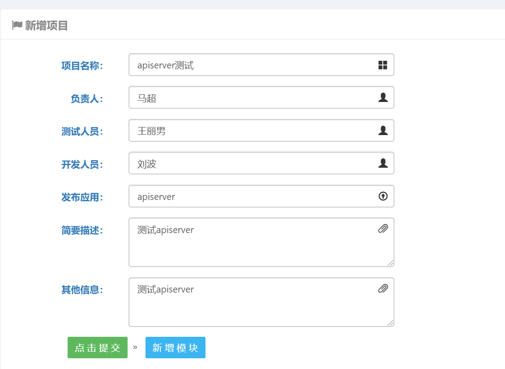

2. 新增模块
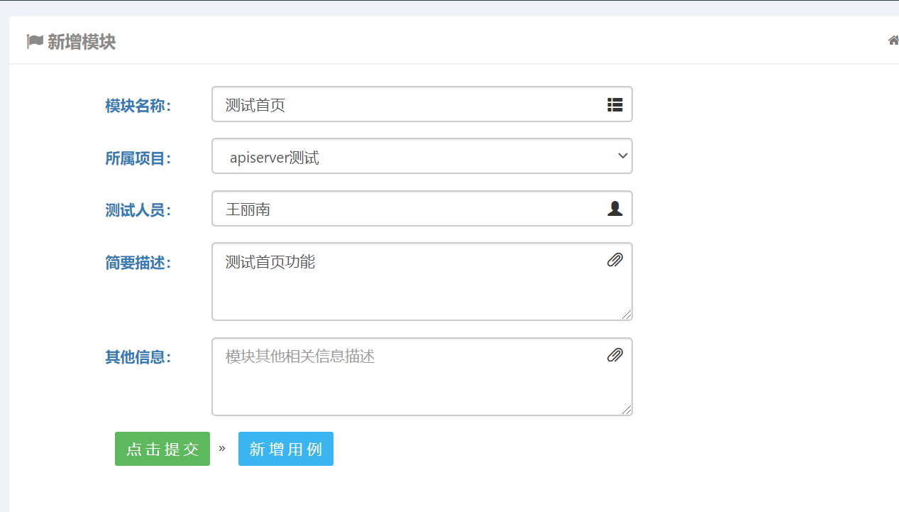

3. 新增测试用例

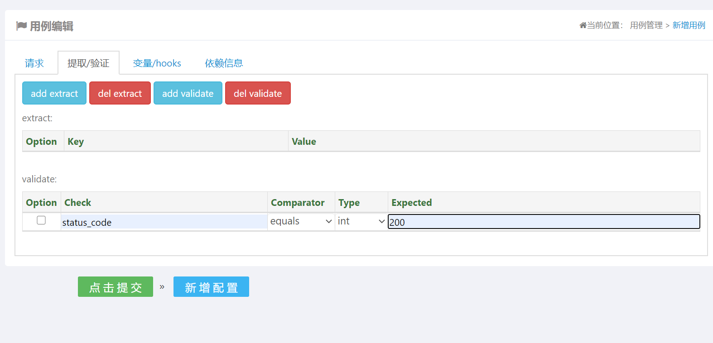
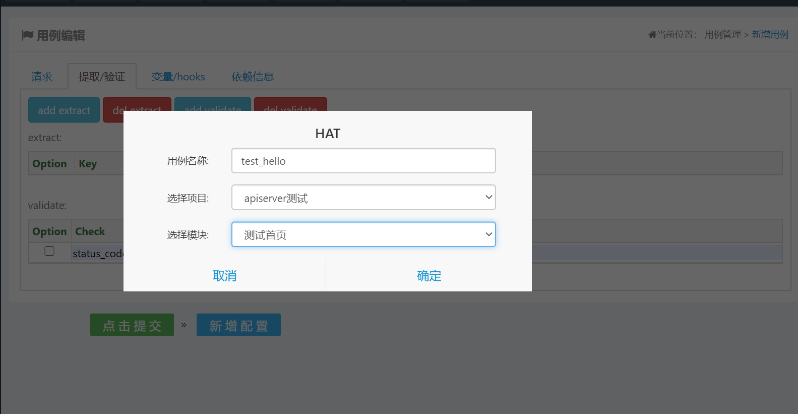

4. 运行用例

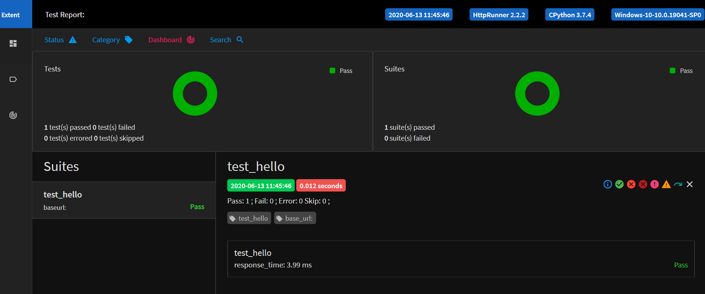

### 高级用例
一、get_token 用例
1. 编写debugtalk
```
#debugtalk.py

import hashlib
import hmac
import random
import string

SECRET_KEY = "DebugTalk"

def gen_random_string(str_len):
    random_char_list = []
    for _ in range(str_len):
        random_char = random.choice(string.ascii_letters + string.digits)
        random_char_list.append(random_char)

    random_string = ''.join(random_char_list)
    return random_string

def get_sign(*args):
    content = ''.join(args).encode('ascii')
    sign_key = SECRET_KEY.encode('ascii')
    sign = hmac.new(sign_key, content, hashlib.sha1).hexdigest()
    return sign
```

2. 定义变量
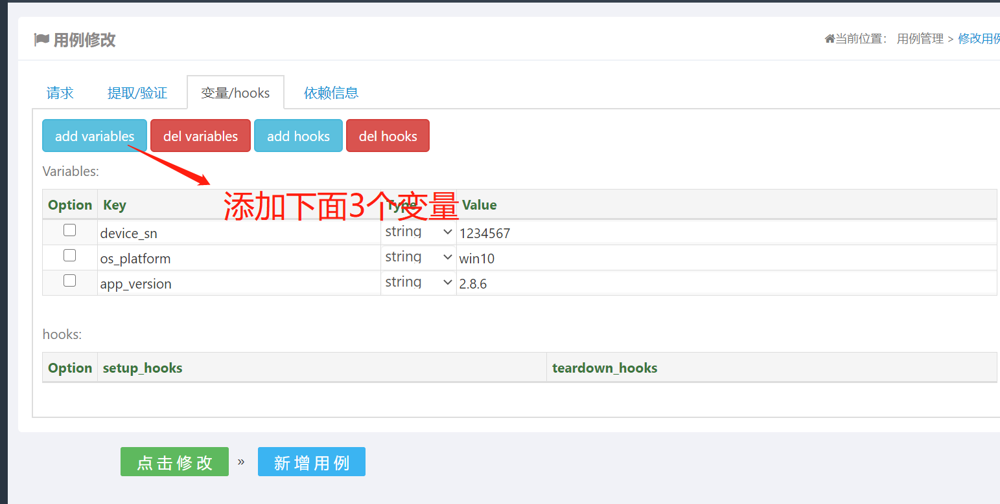

|变量名     | 变量值                   |
|----------|--------------------------|
| device_sn  | ${gen_random_string(15)}|
| os_platform| win10                  |
| app_version| 2.8.6                   |

注： ${gen_random_string(15)} 是debugtalk中定义的函数gen_random_string(str_len)       |

3. 定义请求方法和数据
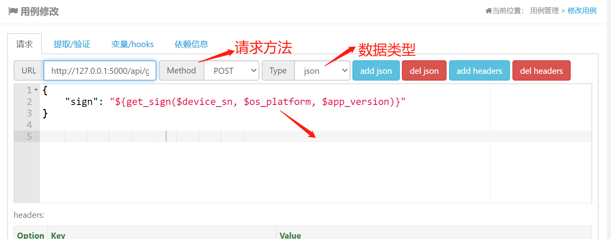

url http://127.0.0.1:5000/api/get-token

方法 post
json
```
{
    "sign": "${get_sign($device_sn, $os_platform, $app_version)}"
}
```
get_sign 为debugtalk中定义的函数$和大括号不能丢
参数为我们刚才定义的变更
4. 定义header
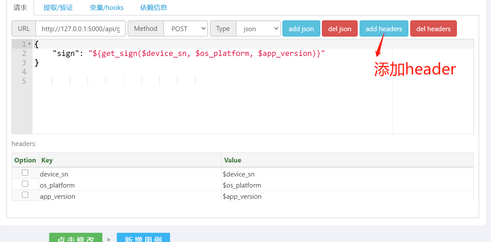

|key     | value                |
|----------|--------------------|
| device_sn  | $device_sn       |
| os_platform| $os_platform     |
| app_version| $app_version     |

二、create_user 用例
1. 定义数据与header
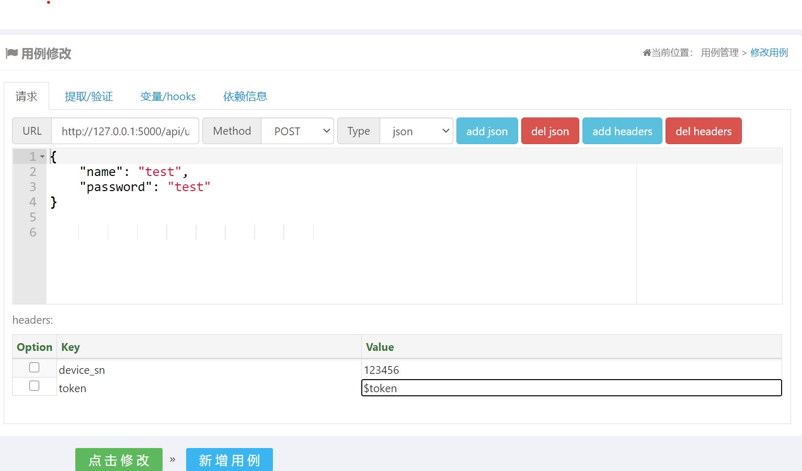

json
```
{
    "name": "test",
    "password": "test"
}

```

header
|key     | value                |
|----------|--------------------|
| device_sn| 12345     |
| token    | $token    |

2. 断言

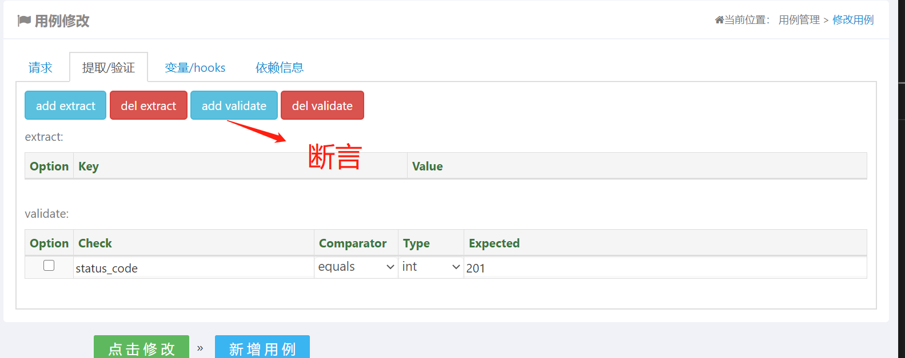
status_code 201

3. 添加依赖

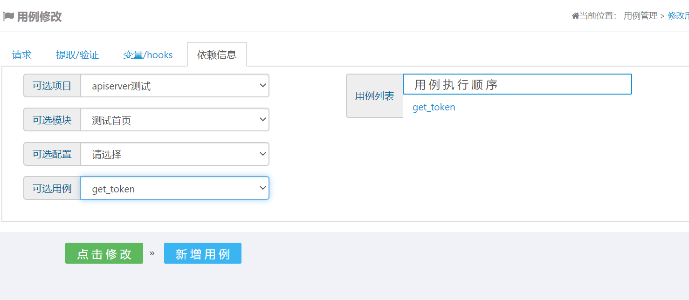

创建用户接口需要一个token，该token可以通过get_token 接口获取

修个get_token 用例添加一个提取
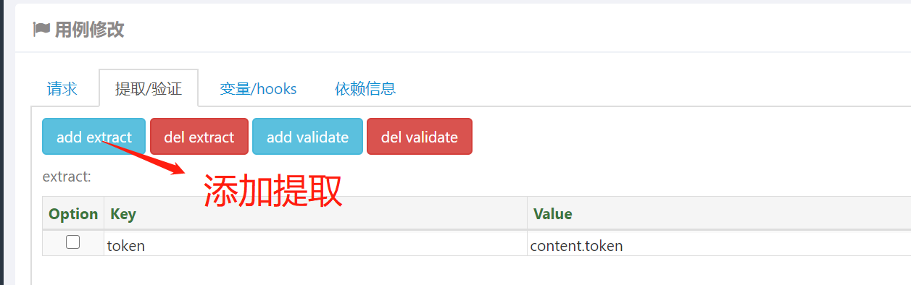
token    content.token

并将get_token用例中的变量 device_sn改为123456

练习修改用户接口

## httprunner

平台底层使用的是httprunnnr进行接口测试，运行测试时会在项目的根目录下有个sutie目录,每次运行都会在suite目录下产生一个时间格式的目录
```
/opt/hat/suite# ls
'2021-02-28 14-35-12-412'  '2021-02-28 14-49-42-857'  '2021-03-06 14-07-41-004'  '2021-03-06 14-18-34-437'  '2021-03-06 14-45-12-737'  '2021-03-06 15-00-50-896'   reports
'2021-02-28 14-36-28-064'  '2021-03-06 13-56-44-754'  '2021-03-06 14-14-44-314'  '2021-03-06 14-26-27-323'  '2021-03-06 14-46-54-131'  '2021-03-06 15-01-39-756'
'2021-02-28 14-36-58-074'  '2021-03-06 13-58-57-868'  '2021-03-06 14-17-06-369'  '2021-03-06 14-44-36-376'  '2021-03-06 14-56-08-401'  '2021-03-06 15-01-58-616'
```

目录结构如下
```
tree '2021-03-06 15-01-58-616'
2021-03-06 15-01-58-616
├── apiserver测试
│   └── 测试首页
│       └── create-user.yml
└── debugtalk.py

2 directories, 2 files

```
里面包含我们项目中的debugtalk.py文件和测试用例文件xxx.yml

yml格式如下
```
-   config:
        base_url: ''
        name: create-user
-   test:
        extract:
        -   token: content.token
        name: get-token
        request:
            headers:
                app_version: $app_version
                device_sn: $device_sn
                os_platform: $os_platform
            json:
                sign: ${get_sign($device_sn, $os_platform, $app_version)}
            method: POST
            url: http://127.0.0.1:5000/api/get-token
        validate:
        -   check: status_code
            comparator: equals
            expect: 200
        variables:
        -   device_sn: '123456'
        -   os_platform: ios
        -   app_version: v1
-   test:
        name: create-user
        request:
            headers:
                device_sn: '123456'
                token: $token
            json:
                name: test
                password: test
            method: POST
            url: http://127.0.0.1:5000/api/users/1004
        validate:
        -   check: status_code
            comparator: equals
            expect: 201

```

我们平台的创建用例就是生成这个yml的文件，运行用例就使用httprunner跑用例

runner.py 中的 run_by_single函数作用就是生成上面的测试目录结构，包括debugtalk.py和yml文件

执行测试用例代码，views.py中的test_run和test_batch_run
```
run_test_by_type(id, base_url, testcase_dir_path, type) #生成测试目录
runner.run(testcase_dir_path) #使用httprunner的run方法，启动测试用例
```
我们也可以直接使用httprunner提供的命令hrun来运行测试用例
```
root@myhub:/opt/hat/suite/2021-03-06 15-01-58-616# hrun  ./
INFO     Start to run testcase: create-user
get-token
INFO     POST http://127.0.0.1:5000/api/get-token
INFO     status_code: 200, response_time(ms): 8.39 ms, response_length: 46 bytes

.
create-user
INFO     POST http://127.0.0.1:5000/api/users/1004
INFO     status_code: 201, response_time(ms): 9.33 ms, response_length: 54 bytes

.

----------------------------------------------------------------------
Ran 2 tests in 0.020s

OK
INFO     Start to render Html report ...
INFO     Generated Html report: /opt/hat/suite/2021-03-06 15-01-58-616/reports/1615016134.html

```

yml配置文件
extract 和 validate 常用字段 
```
response content could be json or html text.

        Args:
            field (str): string joined by delimiter.
            e.g.
                "status_code"
                "headers"
                "cookies"
                "content"
                "headers.content-type"
                "content.person.name.first_name"
```


## celery
关于异步执行我们使用celery框架,具体代码见tasks.py,定时任务使用了django_celery_beat 模块代码见task_opt.py

Celery 是一个简单、灵活且可靠的，处理大量消息的分布式系统，并且提供维护这样一个系统的必需工具。是一个专注于实时处理的任务队列，同时也支持任务调度。


任务队列用作跨线程或机器分配工作的机制。 任务队列的输入是为一个任务。任务队列通过消息系统borker实现。客户端往broker中加任务，worker进程不断监视broker中的任务队列以执行新的任务


支持的常见broker
+ redis
+ rabbitmq
+ zookeeper

安装支持redis的celery
```
pip install celery -i https://pypi.douban.com/simple/
pip install redis -i https://pypi.douban.com/simple/
pip install  eventlet -i https://pypi.douban.com/simple/
```


编写tasks.py
```
from celery import Celery

app = Celery('tasks', broker='redis://127.0.0.1:6379/0')

@app.task
def add(x, y):
    return x + y
```


client.py
```
from tasks import add
add.delay(2,3) 
```

启动 redis
执行client.py 生成一个要执行的任务
`python client.py`
查看redis key
```
127.0.0.1:6379> keys *
1) "celery"
2) "_kombu.binding.celery"
```
查看key类型
```
127.0.0.1:6379> type celery
list
127.0.0.1:6379> type "_kombu.binding.celery"
set
```
查看key 的value
```
127.0.0.1:6379> lrange celery 0 -1
1) "{\"body\": \"W1syLCAzXSwge30sIHsiY2FsbGJhY2tzIjogbnVsbCwgImVycmJhY2tzIjogbnVsbCwgImNoYWluIjogbnVsbCwgImNob3JkIjogbnVsbH1d\", \"content-encoding\": \"utf-8\", \"content-type\": \"application/json\", \"headers\": {\"lang\": \"py\", \"task\": \"tasks.add\", \"id\": \"d0ac9482-bb5f-4b4d-8b70-625cd88aad0d\", \"shadow\": null, \"eta\": null, \"expires\": null, \"group\": null, \"retries\": 0, \"timelimit\": [null, null], \"root_id\": \"d0ac9482-bb5f-4b4d-8b70-625cd88aad0d\", \"parent_id\": null, \"argsrepr\": \"(2, 3)\", \"kwargsrepr\": \"{}\", \"origin\": \"gen15684@LAPTOP-PHMJ1QN6\"}, \"properties\": {\"correlation_id\": \"d0ac9482-bb5f-4b4d-8b70-625cd88aad0d\", \"reply_to\": \"7d107092-94b4-35c8-bb26-20063dc7944d\", \"delivery_mode\": 2, \"delivery_info\": {\"exchange\": \"\", \"routing_key\": \"celery\"}, \"priority\": 0, \"body_encoding\": \"base64\", \"delivery_tag\": \"3526616e-1efc-4eae-867d-1715c8751531\"}}"

127.0.0.1:6379> smembers "_kombu.binding.celery"
1) "celery\x06\x16\x06\x16celery"
```


celery 为一个任务队列列表 等待执行的任务都在这个列表里
_kombu.binding.celery 默认的任务队列名称默认为 celery


启动worker

`celery -A tasks worker --loglevel=info  -P eventlet`


