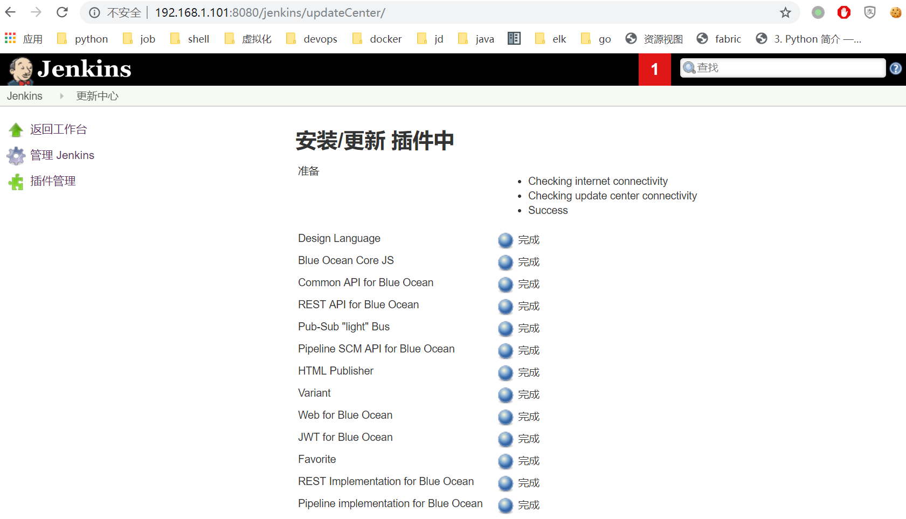

# 第15天 jenkins CICD

## 上传文件到linux环境

```
mkdir /opt/soft
cd /opt/soft

#  使用rz 上传文件
文件从qq群文件下载
jdk-8u11-linux-x64.tar.gz
apache-tomcat-8.5.43.tar.gz
jenkins.war
apache-maven-3.6.1-bin.tar.gz
```

## 配置jdk

```
# 解压文件
tar zxvf jdk-8u11-linux-x64.tar.gz
# 移动文件价到/opt
mv jdk1.8.0_11 /opt
# 进入/opt
cd /opt
# 创建软链
ln -s jdk1.8.0_11 jdk
# 配置jdk 环境变量 在/etc/profile 追加一下内容
export JAVA_HOME=/opt/jdk
export PATH=$JAVA_HOME/bin:$PATH

# 使用环境变量生效
source /etc/profile

# 检查jdk安装
java -version
```

## 安装jenkins

安装jenkins有两种方式
1. 使用war包 直接启动

java -jar jenkins.war

2. 使用tomcat部署

部署tomcat
```
tar zxvf apache-tomcat-8.5.43.tar.gz
mv apache-tomcat-8.5.43 /opt
cd /opt
ln -s apache-tomcat-8.5.43 tomcat

# 启动tomcat
`/opt/tomcat/bin/startup.sh`

访问ip:8080


部署jenkins到tomcat
```
mkdir /opt/tomcat/webapps/jenkins
cp /opt/soft/jenkins.war /opt/tomcat/webapps/jenkins
cd  /opt/tomcat/webapps/jenkins
unzip jenkins.war
```
重启tomcat

```
/opt/tomcat/bin/shutdown.sh
/opt/tomcat/bin/startup.sh
```


访问jenkins

ip:8080/jenkins


复制jenkins初始密码
`cat /root/.jenkins/secrets/initialAdminPassword`


如提示离线，修改/root/.jenkins/hudson.model.UpdateCenter.xml中的url
`https://updates.jenkins.io/update-center.json` 改为
`https://mirrors.tuna.tsinghua.edu.cn/jenkins/updates/update-center.json`

重启tomcat
```
/opt/tomcat/bin/shutdown.sh
/opt/tomcat/bin/startup.sh
```

再次访问ip:8080/jenkins


选择推荐,开始安装


设置账号

实例配置


登录


## 安装maven
```
cd /opt/soft
tar zxvf  apache-maven-3.6.1-bin.tar.gz
mv apache-maven-3.6.1 /opt
ln -s apache-maven-3.6.1 maven

```
配置环境变量修改/etc/profile
```
export JAVA_HOME=/opt/jdk
export MAVEN_HOME=/opt/maven

export PATH=$MAVEN_HOME/bin:$JAVA_HOME/bin:$PATH

```
使配置生效
`source /etc/profile`
## 安装git
`yum install git`
## 使用jekins 创建一个java项目 

点击新建任务
选择-构建一个自由风格的软件项目 输入名称hello-world-build


源代码管理 选择git 并输入git地址
`git@github.com:jiam/hello-world.git`


构建-增加构建步骤 选择 执行shell 输入`mvn clean -U install -DskipTest`


点击 立即构建


构建历史出现一条进度条


点击进度条 选择控制台输出


控制台输出


点击 工作区 浏览构建内容


下载构建后的内容


## 参数化构建

编辑 任务


```
git checkout $version
mvn clean -U package -DskipTest
mv target/*.war target/${JOB_NAME}-$version.war
```
执行参数话构建输入git的 commmit


## 增加发布功能

创建免密码登录的密钥
```

ssh-keygen
Generating public/private rsa key pair.
Enter file in which to save the key (/root/.ssh/id_rsa): 回车

```
配置免密钥登录

```
ssh-copy-id 127.0.0.1
/bin/ssh-copy-id: INFO: Source of key(s) to be installed: "/root/.ssh/id_rsa.pub"
/bin/ssh-copy-id: INFO: attempting to log in with the new key(s), to filter out any that are already installed
/bin/ssh-copy-id: INFO: 1 key(s) remain to be installed -- if you are prompted now it is to install the new keys
root@127.0.0.1's password:

Number of key(s) added: 1

Now try logging into the machine, with:   "ssh '127.0.0.1'"
and check to make sure that only the key(s) you wanted were added.

```


在目标机上创建目录
```
mkdir /opt/packages
mkdir /opt/backup
```

修改job的 构建shell
```
git checkout $version
mvn clean -U package -DskipTest
mv target/*.war target/${JOB_NAME}-$version.war
scp target/${JOB_NAME}-$version.war 127.0.0.1:/opt/packages
ssh 127.0.0.1 "mv /opt/tomcat/webapps/hello-world /opt/backup/hello-world-`date +%Y%m%d%H%M` \
     && cd /opt/packages && unzip /opt/packages/${JOB_NAME}-$version.war -d hello-world \
     && mv hello-world /opt/tomcat/webapps/"
     
ssh 127.0.0.1 "source /etc/profile && /opt/tomcat/bin/shutdown.sh && /opt/tomcat/bin/startup.sh"
```

## 使用pipeline创建项目

新建 任务选择 流水线

pipeline 脚本
```
pipeline {
    agent any
   
    stages {
        stage('git checkout') {
            steps {
                checkout([$class: 'GitSCM', branches: [[name: '*/master']], doGenerateSubmoduleConfigurations: false, extensions: [], submoduleCfg: [], userRemoteConfigs: [[url: 'git@github.com:jiam/hat.git']]])
        
            }    
        }
        stage('Build image') {
            steps {
                sh '''
                      docker build . -t hat:1.0
                      
                   '''
            }
        }
        stage('deloy hat') {
            steps {
                sh '''
                      
                      ssh 127.0.0.1 'docker stop hat; docker rm hat; docker run -d -p 80:80  --name hat hat:1.0'
                      
                   '''
            }
        }
    }
}
```


## 安装blueocean插件

jenkins -系统管理 -插件管理 - 可选插件 - 搜索bule 选择bule ocean



