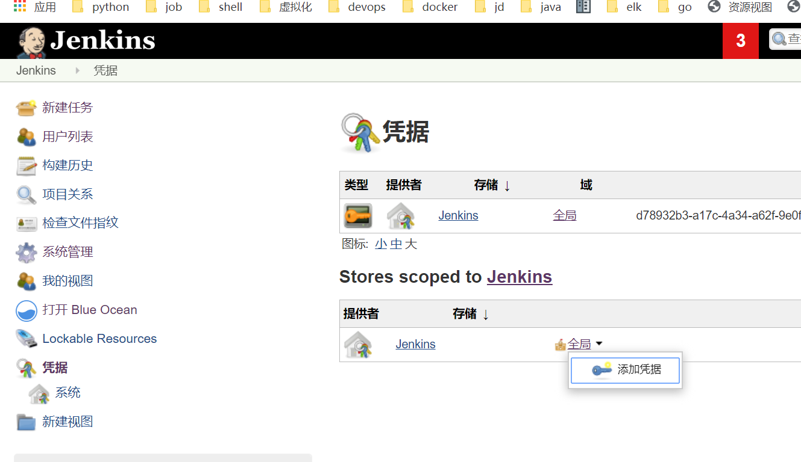

# 第16天

## 分布式jenkins
jenkins-凭据-添加凭据


配置凭据


jenkins-系统管理-节点管理-新建节点


环境变量
```
[root@bogon ~]# cat ~/.bashrc
# .bashrc

# User specific aliases and functions

alias rm='rm -i'
alias cp='cp -i'
alias mv='mv -i'

# Source global definitions
if [ -f /etc/bashrc ]; then
        . /etc/bashrc
fi

export JAVA_HOME=/opt/jdk
export MAVEN_HOME=/opt/maven

export PATH=$MAVEN_HOME/bin:$JAVA_HOME/bin:$PATH

```
最后点击保存

启动日志


节点列表


指定节点执行项目


## 使用docker 启动jenkins

使用下面的 docker run 命令运行 jenkinsci/blueocean 镜像作为Docker中的一个容器(记住，如果本地没有镜像，这个命令会自动下载):

```
docker run \
  --rm \
  -u root \
  -p 8080:8080 \
  -v /root/.jenkins:/var/jenkins_home \
  -v /var/run/docker.sock:/var/run/docker.sock \
  -d jenkinsci/blueocean
```

## jenkins http api

### 获取job 

方法: GET 
URL: /job/{job_name}/api/json

### 获取job 配置文件
方法: GET
URL: /job/{job_name}/config.xml/api/json

### 获取build 信息

方法: GET
URL:  /job/{job_name}/{id}/api/json

### 获取日志信息

方法: GET
URL: /job/{job_name}/{build_number}/logText/progressiveText/api/json

### 运行job

方法: POST 
URL: /job/{job_name}/build/api/json
数据类型: x-www-form-urlencoded
数据: 
```
json='{
	"parameter": [{
		"name": "tag",
		"value": "1.0"
	}]
}'
```

需要禁止csrf否则返回403这个与django一样
禁止csrf
jenkins-系统配置-全局安全配置-跨站请求伪造保护 去掉勾

否则需要先获取crumb
/crumbIssuer/api/json?pretty=true
然后在请求中添加header
Jenkins-Crumb: xxxxxxxxxxxxxx


### 创建job

URL: /createItem/api/json?name=xxx
方法: POST
数据类型: text/xml

数据内容:
```
<?xml version='1.1' encoding='UTF-8'?>
<flow-definition plugin="workflow-job@2.33">
  <actions>
    <org.jenkinsci.plugins.pipeline.modeldefinition.actions.DeclarativeJobAction plugin="pipeline-model-definition@1.3.9"/>
    <org.jenkinsci.plugins.pipeline.modeldefinition.actions.DeclarativeJobPropertyTrackerAction plugin="pipeline-model-definition@1.3.9">
      <jobProperties/>
      <triggers/>
      <parameters/>
      <options/>
    </org.jenkinsci.plugins.pipeline.modeldefinition.actions.DeclarativeJobPropertyTrackerAction>
  </actions>
  <description></description>
  <keepDependencies>false</keepDependencies>
  <properties>
    <hudson.model.ParametersDefinitionProperty>
      <parameterDefinitions>
        <hudson.model.StringParameterDefinition>
          <name>tag</name>
          <description></description>
          <defaultValue></defaultValue>
          <trim>false</trim>
        </hudson.model.StringParameterDefinition>
      </parameterDefinitions>
    </hudson.model.ParametersDefinitionProperty>
    <hudson.plugins.jira.JiraProjectProperty plugin="jira@3.0.9"/>
  </properties>
  <definition class="org.jenkinsci.plugins.workflow.cps.CpsFlowDefinition" plugin="workflow-cps@2.73">
    <script>pipeline {
    agent any
   
    stages {
        stage(&apos;git checkout&apos;) {
            steps {
                checkout([$class: &apos;GitSCM&apos;, branches: [[name: &apos;refs/tags/$tag&apos;]], doGenerateSubmoduleConfigurations: false, extensions: [], submoduleCfg: [], userRemoteConfigs: [[url: &apos;git@github.com:jiam/hat.git&apos;]]])
        
            }    
        }
        stage(&apos;Build image&apos;) {
            steps {
                sh &apos;&apos;&apos;
                      docker build . -t hat:$tag
                      
                   &apos;&apos;&apos;
            }
        }
        stage(&apos;deloy hat&apos;) {
            steps {
                sh &apos;&apos;&apos;
                      
                      ssh 127.0.0.1 &quot;docker stop hat; docker rm hat; docker run -d -p 80:80  --name hat hat:$tag&quot;
                      
                   &apos;&apos;&apos;
            }
        }
    }
}</script>
    <sandbox>true</sandbox>
  </definition>
  <triggers/>
  <disabled>false</disabled>
</flow-definition>
```

### 修改job

URL: jenkins/job/{hat}/config.xml/api/json
方法: POST
数据类型: text/xml

数据内容:
与创建job相同

