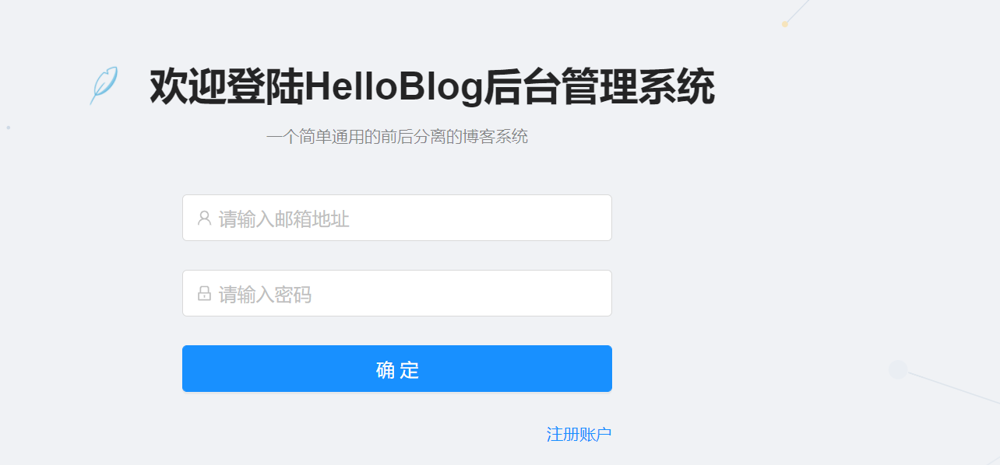
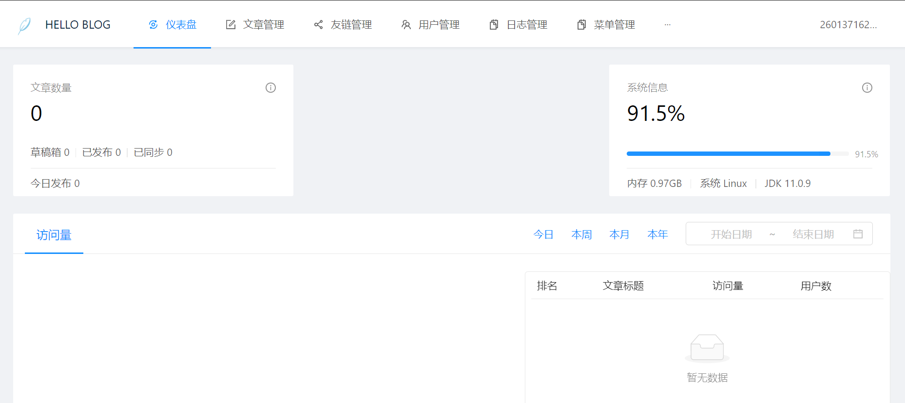
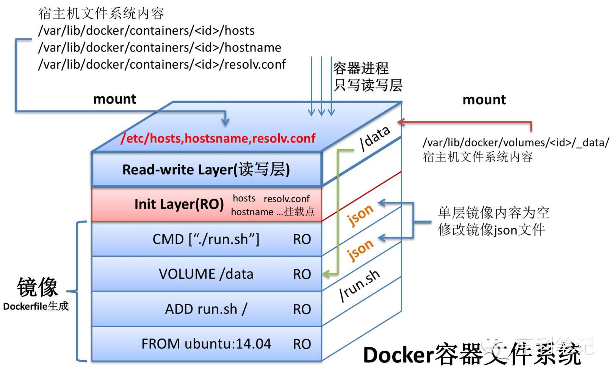
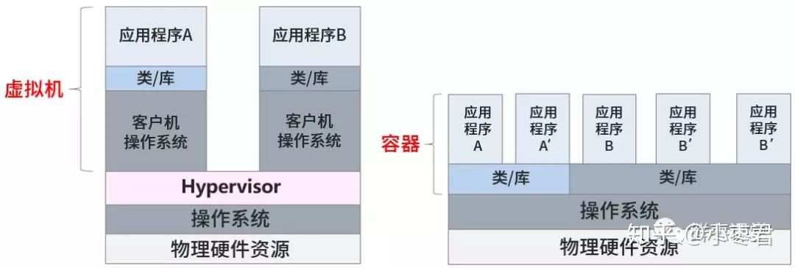
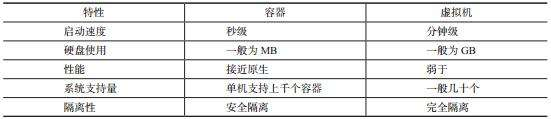

# docker

## 一、环境配置

### 禁用ipv6
```
sysctl -w net.ipv6.conf.all.disable_ipv6=1
sysctl -w net.ipv6.conf.default.disable_ipv6=1
```

### 配置yum源
yum 是centos的软件包管理工具，可通过yum来快速安装软件。修改yum源的默认配置为国内源，提高下载速度
```
cd /etc/yum.repos.d/
rm -f ./*.repo
curl http://mirrors.aliyun.com/repo/Centos-7.repo -o /etc/yum.repos.d/CentOS-Base.repo
yum clean all
```

### 安装docker

```
# 安装docker 依赖的包
yum install -y yum-utils device-mapper-persistent-data lvm2
# 安装docker的yum源
yum-config-manager --add-repo https://download.docker.com/linux/centos/docker-ce.repo
yum install docker-ce docker-ce-cli containerd.io
```

### 配置docker

```
mkdir /etc/docker
cat << EOF> /etc/docker/daemon.json
{
  "insecure-registries" : ["127.0.0.1:5000"],
  "registry-mirrors": [ "https://docker.mirrors.ustc.edu.cn" ],
  "storage-driver": "overlay2",
  "log-driver": "json-file",
  "log-opts": {
    "max-size": "10m",
    "max-file": "3"
  }
}
EOF

```

### 启动docker
`systemctl start docker`

### 设置开启启动
`systemctl enable docker`

### 查看docker信息
`docker info`

## 使用镜像

### 拉取镜像

从 Docker 镜像仓库获取镜像的命令是 docker pull。其命令格式为：
`docker pull [Docker Registry 地址]/[仓库名/]软件名[:标签]`

Docker 镜像仓库地址：地址的格式一般是 <域名/IP>[:端口号]。默认地址是docker.io。
仓库名如不给出，则默认为 library。
标签名如果不给出，则默认为latest。

拉取nginx镜像
`docker pull nginx`
输出结果
```
Using default tag: latest
latest: Pulling from library/nginx
852e50cd189d: Pull complete 
571d7e852307: Pull complete 
addb10abd9cb: Pull complete 
d20aa7ccdb77: Pull complete 
8b03f1e11359: Pull complete 
Digest: sha256:6b1daa9462046581ac15be20277a7c75476283f969cb3a61c8725ec38d3b01c3
Status: Downloaded newer image for nginx:latest
docker.io/library/nginx:latest

```
`docker pull nginx`
 其实就是
 
 `docker.io/library/nginx:latest`

+ docker.io 为镜像仓库地址，
+ library/nginx 为仓库名
+ latest 为版本号

### 列出本地镜像

要想列出已经下载下来的镜像，可以使用 `docker image list` 命令，快捷命令`docker images`
输出结果
```
docker images
REPOSITORY          TAG                 IMAGE ID            CREATED             SIZE
nginx               latest              bc9a0695f571        7 days ago          133MB

```

### 删除本地镜像
如果要删除本地的镜像，可以使用 `docker image rm 镜像名/id` 命令，快捷命令`docker rmi 镜像名/id`
`docker rmi nginx`
```
Untagged: nginx:latest
Untagged: nginx@sha256:6b1daa9462046581ac15be20277a7c75476283f969cb3a61c8725ec38d3b01c3
Deleted: sha256:bc9a0695f5712dcaaa09a5adc415a3936ccba13fc2587dfd76b1b8aeea3f221c
Deleted: sha256:a6862ade3b91fdde2aa8a3d77fdcc95b1eb6c606be079c11b7f97f249d0e731d
Deleted: sha256:32bcbe3740b68d0625744e774b404140366c0c4a2b2eadf32280d66ba001b4fb
Deleted: sha256:2dc5e43f496e41a18c016904b6665454a53be22eb4dcc1b468d864b4e2d1f311
Deleted: sha256:5fe6a7c579cd9fbcfa604810974c4c0c16893f4c40bc801545607ebd0accea74
Deleted: sha256:f5600c6330da7bb112776ba067a32a9c20842d6ecc8ee3289f1a713b644092f8
```

### 使用dockerfile构建镜像

以springboot的helloword (git clone https://github.com/goxr3plus/Simplest-Spring-Boot-Hello-World.git)

使用`mvn package`进行构建生成包example.smallest-0.0.1-SNAPSHOT.war

安装lrzsz包，用来上传文件到centos
`yum install lrzsz`

使用jdk镜像`https://hub.docker.com/r/adoptopenjdk/openjdk11/`

`docker pull adoptopenjdk/openjdk11`

创建Dockerfile文件
```
FROM adoptopenjdk/openjdk11
COPY example.smallest-0.0.1-SNAPSHOT.war /opt
CMD java -jar /opt/example.smallest-0.0.1-SNAPSHOT.war
```

构建镜像
`docker build .`

输出结果
```
Sending build context to Docker daemon  17.59MB
Step 1/3 : FROM adoptopenjdk/openjdk11
 ---> 0adf76d909d3
Step 2/3 : COPY example.smallest-0.0.1-SNAPSHOT.war /opt
 ---> 5424591b5227
Step 3/3 : CMD java -jar /opt/example.smallest-0.0.1-SNAPSHOT.war
 ---> Running in aa4c2e0896ab
Removing intermediate container aa4c2e0896ab
 ---> d8af82f05d1b
Successfully built d8af82f05d1b
```
### 给镜像打标签

`docker tag d8af82f05d1b helloword:1.0`

### 导出、导入镜像
可以通过导出、导入将一个镜像从一台机器拷贝到另一台机器，在没有registry（镜像仓库服务）情况下

导出

`docker save 镜像名 -o  文件名`

导入

`docker load -i 文件名`

### 运行容器

创建并启动容器

`docker run helloword:1.0`

查看运行中的容器

`docker ps`

停止容器

`docker stop 容器id/容器name`

后台运行容器

`docker run -d helloword:1.0`

给容器指定名称

`docker run --name=helloword  -d helloword:1.0`

修改容器名称

`docker rename oldname newname`

启动容器

`docker start 容器id/容器name`

查看所有容器

`docker ps -a`


### 查看容器ip

`docker inspec 容器id/容器name`

```
"NetworkSettings": {
            "Bridge": "",
            "SandboxID": "171e082b7837df515ed0c8b8aa528be0be45e33a984eb3b38c98021d37321b26",
            "HairpinMode": false,
            "LinkLocalIPv6Address": "",
            "LinkLocalIPv6PrefixLen": 0,
            "Ports": {},
            "SandboxKey": "/var/run/docker/netns/171e082b7837",
            "SecondaryIPAddresses": null,
            "SecondaryIPv6Addresses": null,
            "EndpointID": "ee89a75960c84244faab9fba0bf56255dadc1afa73a6a517960b9389cf153372",
            "Gateway": "172.17.0.1",
            "GlobalIPv6Address": "",
            "GlobalIPv6PrefixLen": 0,
            "IPAddress": "172.17.0.2", # 为该容器的ip
            "IPPrefixLen": 16,
            "IPv6Gateway": "",
            "MacAddress": "02:42:ac:11:00:02",
            "Networks": {
                "bridge": {
                    "IPAMConfig": null,
                    "Links": null,
                    "Aliases": null,
                    "NetworkID": "4945a03615341f138f5005068bbdaa5a5404df38389f47525ae1654e41e5b731",
                    "EndpointID": "ee89a75960c84244faab9fba0bf56255dadc1afa73a6a517960b9389cf153372",
                    "Gateway": "172.17.0.1",
                    "IPAddress": "172.17.0.2",
                    "IPPrefixLen": 16,
                    "IPv6Gateway": "",
                    "GlobalIPv6Address": "",
                    "GlobalIPv6PrefixLen": 0,
                    "MacAddress": "02:42:ac:11:00:02",
                    "DriverOpts": null
                }
            }

```
使用curl 访问程序

`curl 172.17.10.2:8080`

输出hellow world

### 进入容器

`docker exec -it 容器id/names`
```
[root@192 ~]# docker exec -it youthful_shockley /bin/bash
root@733715cd78a3:/# java -version
openjdk version "11.0.9" 2020-10-20
OpenJDK Runtime Environment AdoptOpenJDK (build 11.0.9+11)
OpenJDK 64-Bit Server VM AdoptOpenJDK (build 11.0.9+11, mixed mode)
root@733715cd78a3:/# ps aux
USER       PID %CPU %MEM    VSZ   RSS TTY      STAT START   TIME COMMAND
root         1  0.0  0.0   2600   652 ?        Ss   13:12   0:00 /bin/sh -c java -jar /opt/example.smallest-0.0.1-SNAPSHOT.war
root         6 11.5 14.4 2331160 146616 ?      Sl   13:12   0:12 java -jar /opt/example.smallest-0.0.1-SNAPSHOT.war
root        38  0.1  0.2   7224  2376 pts/0    Ss   13:13   0:00 /bin/bash
root        56  0.0  0.1   8876  1592 pts/0    R+   13:14   0:00 ps aux
```

### 删除容器
删除容器前首先要停止容器

`docker rm 容器id/容器name`

### 从网络访问容器
docker run指定容器映射到主机的端口

`docker run --name=helloword -p80:8080 -d  helloword:1.0`

将容器的8080端口映射到主机

启动后在浏览器输入http://主机ip 就可以访问到helloword


## 实战使用docker运行一个blog
git地址https://github.com/byteblogs168/plumemo

在root下创建blog目录，将plumemo-v1.2.0.jar上传到blog目录里

在blog目录里创建Dockerfile

```
FROM adoptopenjdk/openjdk11
COPY plumemo-v1.2.0.jar /opt
CMD java -jar /opt/plumemo-v1.2.0.jar
```

构建镜像并打标签

`docker build . -t plumemo:v1.2.0`

拉取mysql镜像

`docker pull mysql/mysql-server:5.6`

启动mysql

`docker run --name=mysql -p3306:3306  -d mysql/mysql-server:5.6`

查看mysql密码

`docker logs mysql 2>&1 | grep GENERATED`

访问mysql

`docker exec -it mysql mysql -uroot -p`

修改rmysql root密码
```
set password for root@localhost = password('rootpw');;
```
添加blog用户
```
create user 'blog'@'%' identified by 'blog';
```

创建数据库
```
CREATE DATABASE `blog` /*!40100 DEFAULT CHARACTER SET utf8 */
```

授权用户
```
GRANT ALL PRIVILEGES ON blog.*  TO 'blog'@'%' IDENTIFIED BY 'blog' WITH GRANT OPTION;
flush privileges;
```
查看mysql ip
`docker inspect mysql`

启动blog api
```
 docker run -d -e MYSQL_DATABASE="jdbc:mysql://mysqlhost:3306/blog?useSSL=false&characterEncoding=utf8" -e MYSQL_USERNAME=blog -e MYSQL_PASSWORD=blog -p8086:8086  --add-host=mysqlhost:172.17.0.2 --name blog-api plumemo:v1.2.0
```

创建blog-ui目录

将dist.tar.gz上传到blog-ui目录

执行解压命令

`tar zxvf dist.tar.gz`

拉取nodejs镜像

`docker pull  node:10.23.0`

创建Dockerfile文件
```
FROM nginx
COPY dist  /opt/blog/dist
COPY default.conf /etc/nginx/conf.d/default.conf
WORKDIR /opt/blog
CMD nginx -g "daemon off;"
```
创建nginx的配置文件default.conf
```
server {
    listen       80;
    server_name  localhost;

    charset utf-8;
    access_log  /var/log/nginx/access.log  main;

    location /api/blog {
        proxy_pass http://blog-api:8086/api/plumemo-service;
    }

    location /admin {
       alias  /opt/blog/dist;
    }


    error_page  404              /404.html;

    error_page   500 502 503 504  /50x.html;
    location = /50x.html {
        root   /usr/share/nginx/html;
    }
}
```
构建编译

`docker build . -t ui:1.2.0`

运行ui

`docker run -d -p 80:80 --add-host=blog-api:172.17.0.3 ui:1.20`




## docker 基本概念
Docker 包括三个基本概念
+ 镜像（Image）
+ 容器（Container）
+ 仓库（Repository）

### 镜像
Docker 镜像是一个特殊的文件系统，除了提供容器运行时所需的程序、库、资源、配置等文件外，还包含了一些为运行时准备的一些配置参数（如匿名卷、环境变量、用户等）。镜像不包含任何动态数据，其内容在构建之后也不会被改变。镜像构建时，会一层层构建，前一层是后一层的基础。每一层构建完就不会再发生改变，后一层上的任何改变只发生在自己这一层。

### 容器
镜像（Image）和容器（Container）的关系，就像是面向对象程序设计中的 类 和 实例 一样，镜像是静态的定义，容器是镜像运行时的实体。容器可以被创建、启动、停止、删除、暂停等。每一个容器运行时，是以镜像为基础层，在其上创建一个当前容器的存储层，我们可以称这个为容器运行时读写而准备的存储层为 容器存储层。容器中所有的写入修改都是卸载容器的存储层的，不会对镜像做任何修改。


#### 仓库
镜像构建完成后，可以很容易的在当前宿主机上运行，但是，如果需要在其它服务器上使用这个镜像，我们就需要一个集中的存储、分发镜像的服务。
我们docker pull的时候就是从仓库拉取镜像
## docke 与虚拟机的区别
虚拟机：
我们传统的虚拟机需要模拟整台机器包括硬件，每台虚拟机都需要有自己的操作系统，虚拟机一旦被开启，预分配给他的资源将全部被占用。每一个虚拟机包括应用，公共依赖(必要的二进制和库)，以及一个完整的用户操作系统。

Docker：
容器技术是和我们的宿主机共享硬件资源及操作系统可以实现资源的动态分配。容器包含应用和其所有的依，但是与其他容器共享内核。容器在宿主机操作系统中，在用户空间以分离的进程运行。





